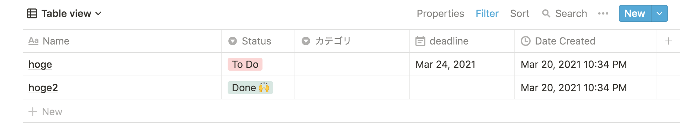

# Usage

Notion上のDatabaseのタスクをGoogleカレンダーに登録する。

## Notion Databaseのサンプル



## 環境構築〜スクリプト実行

```
pip install notion
python add_reminder_from_notion.py
```

## TIPS

### フォーマッター

`pipenv run autopep8 --in-place --aggressive --aggressive *.py`
